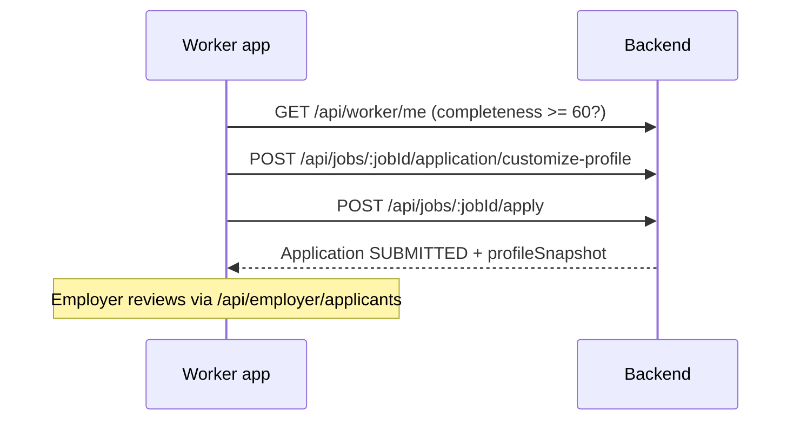

# Joballa Worker Portal — Frontend API Guide

**Last updated:** May 24, 2026  
**Production API:** [https://joballa-api.onrender.com](https://joballa-api.onrender.com)  
**Base paths:** `/api/worker`, `/api/jobs`, `/api/applications`, `/api/saved-jobs`, `/api/earnings`  
**Audience:** Frontend developers building the worker app (profile builder, job feed, applications, earnings, engagements)

Verified against local API with `npm run smoke:worker` and demo accounts (May 24, 2026).

**Related:**

- Employer hiring flow: [FRONTEND_EMPLOYER_PORTAL_API_GUIDE_MAY_2026.md](./FRONTEND_EMPLOYER_PORTAL_API_GUIDE_MAY_2026.md)
- Admin moderation (KYC, jobs): [FRONTEND_ADMIN_PANEL_API_GUIDE_MAY_2026.md](./FRONTEND_ADMIN_PANEL_API_GUIDE_MAY_2026.md)
- Internal module reference: [docs/routes/07- workers-module.md](../docs/routes/07-%20workers-module.md)
- Auth is shared at `/auth/*`

---

## Table of contents

1. [Overview](#1-overview)
2. [Authentication](#2-authentication)
3. [Response format & errors](#3-response-format--errors)
4. [Route index (43 routes)](#4-route-index-43-routes)
5. [Session & profile (`/api/worker`)](#5-session--profile-apiworker)
6. [Job discovery (`/api/jobs`)](#6-job-discovery-apijobs)
7. [Applications](#7-applications)
8. [Saved jobs](#8-saved-jobs)
9. [Earnings](#9-earnings)
10. [Engagements](#10-engagements)
11. [Apply flow & profile completeness](#11-apply-flow--profile-completeness)
12. [Status & enum reference](#12-status--enum-reference)
13. [Smoke tests & env vars](#13-smoke-tests--env-vars)
14. [Document history](#14-document-history)

---

## 1. Overview

The worker portal API lets **verified workers** (`Role.WORKER`):

- Build and maintain a **professional profile** (skills, work history, education, KYC, payment details)
- **Search and browse** live jobs posted by employers
- **Save**, **hide**, or **report** jobs
- **Customize** profile per job and **submit applications** (with profile snapshot)
- Track **applications**, **hired engagements**, and **earnings**

All worker-scoped routes require:

```http
Authorization: Bearer <accessToken>
```

The JWT must belong to a user with role **`WORKER`**. Other roles receive **403 Forbidden**.

Responses are **raw JSON** (no `{ success, data }` wrapper), same as the employer portal.

### Base paths at a glance

| Area | Base path | Role |
|------|-----------|------|
| Profile & account | `/api/worker` | `WORKER` |
| Job feed & actions | `/api/jobs` | `WORKER` |
| Applications | `/api/applications` + `/api/jobs/:jobId/...` | `WORKER` |
| Saved jobs list | `/api/saved-jobs` | `WORKER` |
| Earnings | `/api/earnings` | `WORKER` |
| Engagements | `/api/worker/engagements` | `WORKER` |

---

## 2. Authentication

### 2.1 Obtain a token

```http
POST /auth/login
Content-Type: application/json

{
  "identifier": "worker@example.com",
  "password": "your-password"
}
```

**Success (`200`):**

```json
{
  "accessToken": "eyJhbGciOiJIUzI1NiIs...",
  "user": {
    "id": "uuid",
    "email": "worker@example.com",
    "role": "WORKER"
  }
}
```

**Errors:** `401` invalid credentials; `403` if account is not a worker.

Worker signup UI:

1. `POST /auth/register` — `{ email, password, role: "WORKER", languagePreference: "EN" }`
2. `POST /auth/verify` — `{ identifier, otp, role, password, languagePreference }`
3. Store `accessToken` from verify response

A **WorkerProfile** row is created automatically on register/verify/login (minimal `fullName` seed).

### 2.2 Refresh session

```http
POST /auth/refresh
```

Requires httpOnly cookie `refreshToken` (set at login). Use `credentials: 'include'` in the browser.

### 2.3 Recommended client flow

1. Login → store `accessToken`
2. `GET /api/worker/me` on app launch (hydrate profile + completeness)
3. On **401**, try refresh once, then redirect to login
4. Attach `Authorization: Bearer <token>` to every worker API call

---

## 3. Response format & errors

### 3.1 Success

Most endpoints return the resource **directly** in the response body (HTTP 2xx).

**Paginated lists:**

```json
{
  "items": [],
  "total": 12,
  "page": 1,
  "limit": 20
}
```

**Job search** returns the same shape; each item is a job card (title, employer, pay, city, etc.).

**DELETE** routes often return **`204 No Content`** with no JSON body.

### 3.2 Errors (global filter)

```json
{
  "statusCode": 403,
  "error": "ForbiddenException",
  "message": "Profile completeness is 45%. A minimum of 60% is required to apply.",
  "path": "/api/jobs/uuid/apply",
  "timestamp": "2026-05-24T21:46:07.297Z"
}
```

| Code | Meaning |
|------|---------|
| `400` | Validation or business rule |
| `401` | Missing or invalid JWT |
| `403` | Not a worker, or rule blocked (e.g. completeness &lt; 60% to apply) |
| `404` | Resource not found or not owned by this worker |
| `409` | Conflict (e.g. already applied, duplicate save) |
| `429` | Rate limit (too many login/API calls in dev — wait and retry) |
| `500` | Server error |

Validation failures may return `message` as a **string array**.

---

## 4. Route index (43 routes)

### Profile — `/api/worker` (22)

| # | Method | Route | Purpose |
|---|--------|-------|---------|
| 1 | GET | `/api/worker/me` | Session + profile summary |
| 2 | GET | `/api/worker/profile` | Full profile with nested sections |
| 3 | GET | `/api/worker/profile/:workerId/public` | Public profile by WorkerProfile ID |
| 4 | PATCH | `/api/worker/profile/personal-info` | Name, location, languages, availability |
| 5 | PATCH | `/api/worker/profile/professional-summary` | Title, bio, industries, job types |
| 6 | PATCH | `/api/worker/profile/skills` | Replace skills array |
| 7 | POST | `/api/worker/profile/avatar` | Upload avatar (multipart) |
| 8 | POST | `/api/worker/profile/work-history` | Add work history |
| 9 | PATCH | `/api/worker/profile/work-history/:workId` | Update entry |
| 10 | DELETE | `/api/worker/profile/work-history/:workId` | Remove entry |
| 11 | POST | `/api/worker/profile/education` | Add education |
| 12 | PATCH | `/api/worker/profile/education/:educationId` | Update entry |
| 13 | DELETE | `/api/worker/profile/education/:educationId` | Remove entry |
| 14 | POST | `/api/worker/profile/certifications` | Add certification |
| 15 | PATCH | `/api/worker/profile/certifications/:certId` | Update entry |
| 16 | DELETE | `/api/worker/profile/certifications/:certId` | Remove entry |
| 17 | POST | `/api/worker/profile/documents` | Upload document (multipart, stub) |
| 18 | GET | `/api/worker/profile/documents` | List documents |
| 19 | DELETE | `/api/worker/profile/documents/:documentId` | Delete document |
| 20 | POST | `/api/worker/profile/kyc` | Submit KYC (Cloudinary URLs) |
| 21 | GET | `/api/worker/profile/kyc` | Latest KYC status |
| 22 | PATCH | `/api/worker/profile/payment-details` | MoMo / bank details |

### Jobs — `/api/jobs` (8)

| # | Method | Route | Purpose |
|---|--------|-------|---------|
| 23 | GET | `/api/jobs` | Search/filter live jobs |
| 24 | GET | `/api/jobs/:jobId` | Job detail |
| 25 | POST | `/api/jobs/:jobId/save` | Save job |
| 26 | DELETE | `/api/jobs/:jobId/save` | Unsave job |
| 27 | POST | `/api/jobs/:jobId/hide` | Hide from feed |
| 28 | DELETE | `/api/jobs/:jobId/hide` | Unhide |
| 29 | POST | `/api/jobs/:jobId/report` | Report job |
| 30 | GET | `/api/jobs/:jobId/share` | Shareable deep link |

### Applications (5)

| # | Method | Route | Purpose |
|---|--------|-------|---------|
| 31 | POST | `/api/jobs/:jobId/application/customize-profile` | Per-job profile draft |
| 32 | POST | `/api/jobs/:jobId/apply` | Submit application |
| 33 | GET | `/api/applications` | Worker's applications |
| 34 | GET | `/api/applications/:applicationId` | Application detail |
| 35 | DELETE | `/api/applications/:applicationId` | Archive (soft delete) |

### Saved jobs — `/api/saved-jobs` (3)

| # | Method | Route | Purpose |
|---|--------|-------|---------|
| 36 | GET | `/api/saved-jobs` | List saved jobs |
| 37 | DELETE | `/api/saved-jobs/:jobId` | Remove one saved job |
| 38 | DELETE | `/api/saved-jobs` | Bulk remove (body: `jobIds[]`) |

### Earnings — `/api/earnings` (3)

| # | Method | Route | Purpose |
|---|--------|-------|---------|
| 39 | GET | `/api/earnings/summary` | Totals & pending |
| 40 | GET | `/api/earnings/transactions` | Paginated payments |
| 41 | GET | `/api/earnings/statement` | Export list (date range) |

### Engagements — `/api/worker/engagements` (2)

| # | Method | Route | Purpose |
|---|--------|-------|---------|
| 42 | GET | `/api/worker/engagements` | Hired jobs / contracts |
| 43 | GET | `/api/worker/engagements/:engagementId` | Engagement detail |

---

## 5. Session & profile (`/api/worker`)

### 5.1 `GET /api/worker/me`

| | |
|---|---|
| **Purpose** | App shell: user + `workerProfile` summary, **profileCompleteness** |
| **Auth** | Bearer, role `WORKER` |

**Response (`200`):** User fields + nested `workerProfile` (id, fullName, city, professionalTitle, completeness, availability, verificationStatus, etc.).

Use on every cold start to drive onboarding banners (“complete profile to apply”).

---

### 5.2 `GET /api/worker/profile`

Full profile including `workHistories`, `educations`, `certifications`, `documents`, `kycSubmissions`.

---

### 5.3 `GET /api/worker/profile/:workerId/public`

| | |
|---|---|
| **Path param** | `workerId` = **WorkerProfile.id** (not User.id) |
| **Use** | Preview public card; employers see snapshot on apply |

Excludes payment details, full KYC images, bank data.

---

### 5.4 Profile sections (PATCH / POST / DELETE)

| Endpoint | Notes |
|----------|--------|
| `PATCH .../personal-info` | Optional fields: `firstName`, `lastName`, `city`, `region`, `country`, `languages[]`, `availabilityStatus` |
| `PATCH .../professional-summary` | `title`, `summary`, `industries[]`, `preferredJobTypes[]` (enum) |
| `PATCH .../skills` | **Required** `skills: string[]` — **replaces** entire list |
| `PATCH .../payment-details` | `mobileMoneyProvider`, `mobileMoneyNumber`, `bankName`, `accountNumber` |

**Work history / education / certifications:** `POST` → `201` + created `id`; `PATCH` by id; `DELETE` → `204`.

Each successful profile mutation **recomputes** `profileCompleteness` on the server.

---

### 5.5 `POST /api/worker/profile/avatar`

| | |
|---|---|
| **Content-Type** | `multipart/form-data` |
| **Field** | `file` — JPEG, PNG, WEBP, max **5 MB** |

> **Note:** Upload may return a **stub** response until Cloudinary `FilesService` is fully wired. Endpoint validates file type/size and is safe to call from UI.

---

### 5.6 Documents & KYC

**Documents**

- `POST .../documents` — multipart `file`; query `?type=CV|CERTIFICATE|PORTFOLIO|OTHER` (stub upload)
- `GET .../documents` — array of document records
- `DELETE .../documents/:documentId` — `204`

**KYC**

1. Upload ID images via files API (when available): `POST /files/verification-doc`
2. `POST .../kyc` with body:

```json
{
  "documentType": "NATIONAL_ID",
  "frontIdImageUrl": "https://res.cloudinary.com/.../front.jpg",
  "backIdImageUrl": "https://res.cloudinary.com/.../back.jpg"
}
```

- `GET .../kyc` — latest submission or `null`
- **400** if status is already `PENDING` or `VERIFIED`

Admin reviews KYC under `/admin/kyc/*` (see admin guide).

---

## 6. Job discovery (`/api/jobs`)

Only jobs with status **`ACTIVE`** appear in search (employer jobs go **live** after admin approval).

### 6.1 `GET /api/jobs`

**Query parameters (all optional):**

| Param | Type | Description |
|-------|------|-------------|
| `keyword` | string | Title, description, category |
| `city` | string | |
| `category` | string | |
| `jobType` | enum | `FULL_TIME`, `PART_TIME`, `CONTRACT`, `CASUAL`, `SEASONAL`, `INTERNSHIP` |
| `workMode` | enum | `ON_SITE`, `REMOTE`, `HYBRID` |
| `payStructure` | enum | `HOURLY`, `DAILY`, `WEEKLY`, `MONTHLY`, `FIXED` |
| `minPay` | number | |
| `maxPay` | number | |
| `sortBy` | `createdAt` \| `payRate` | |
| `sortOrder` | `asc` \| `desc` | |
| `page` | number | default `1` |
| `limit` | number | default `20`, max `50` |

Hidden jobs (worker called hide) are excluded automatically.

**Response:** `{ items, total, page, limit }` — each item includes employer company name, logo, pay, location, etc.

---

### 6.2 `GET /api/jobs/:jobId`

Full job detail + employer block + application count.

---

### 6.3 Save / unsave

```http
POST /api/jobs/:jobId/save    → 200, saved record
DELETE /api/jobs/:jobId/save  → 204
```

Also listed under `GET /api/saved-jobs`.

---

### 6.4 Hide / unhide

```http
POST /api/jobs/:jobId/hide    → 200
DELETE /api/jobs/:jobId/hide  → 204
```

Hidden jobs no longer appear in `GET /api/jobs`.

---

### 6.5 Report

```http
POST /api/jobs/:jobId/report
Content-Type: application/json

{
  "reason": "OTHER",
  "description": "Optional details"
}
```

**`reason` enum:** `FAKE_JOB`, `MISLEADING_DESCRIPTION`, `INAPPROPRIATE_CONTENT`, `SCAM`, `DUPLICATE`, `OTHER`

**Response:** `201`

---

### 6.6 Share link

```http
GET /api/jobs/:jobId/share
```

**Response (`200`):**

```json
{
  "url": "https://joballa.cm/jobs/<jobId>"
}
```

(Base URL may change per environment.)

---

## 7. Applications

### 7.1 Recommended UI flow



### 7.2 `POST /api/jobs/:jobId/application/customize-profile`

Optional per-job draft (stored 7 days).

```json
{
  "professionalSummary": "Why I fit this role...",
  "skills": ["cooking", "cleaning"],
  "workHistoryIds": ["work-history-uuid-1"]
}
```

**Response:** `200` — customization record.

---

### 7.3 `POST /api/jobs/:jobId/apply`

| Rule | Detail |
|------|--------|
| Completeness | `profileCompleteness` ≥ **60** |
| Duplicate | One application per worker per job → **409** if already applied |
| Snapshot | Server stores immutable `profileSnapshot` JSON at submit time |

**Body (optional):**

```json
{
  "jobSpecificNote": "I can start next Monday.",
  "attachedDocuments": ["document-uuid"]
}
```

**Response:** `201` — application object with `id`, `status` (`SUBMITTED`), job summary.

**403 example:** completeness below 60%.

---

### 7.4 `GET /api/applications`

**Query:** `status` = `SUBMITTED` \| `SHORTLISTED` \| `HIRED` \| `REJECTED`; `page`, `limit`

Excludes archived applications (`archivedAt` set).

---

### 7.5 `GET /api/applications/:applicationId`

Includes `job`, `employer`, and `engagement` (if hired).

---

### 7.6 `DELETE /api/applications/:applicationId`

Soft-archive for worker UI (**204**). Record kept for employer/audit.

---

## 8. Saved jobs

### `GET /api/saved-jobs`

Query: `page`, `limit`

**Response:** paginated list; each item includes nested `job` card.

### `DELETE /api/saved-jobs/:jobId`

Remove one saved job — **204**.

### `DELETE /api/saved-jobs` (bulk)

```json
{
  "jobIds": ["uuid-1", "uuid-2"]
}
```

**204** — removes all listed IDs for this worker.

---

## 9. Earnings

Shown after employer initiates payments (`/api/employer/payments/*`).

### `GET /api/earnings/summary`

```json
{
  "totalEarned": 0,
  "totalPayments": 0,
  "pendingAmount": 0,
  "thisMonthTotal": 0,
  "currency": "XAF"
}
```

### `GET /api/earnings/transactions`

Query: `page`, `limit`, optional `status`, `engagementId`, `from`, `to` (ISO dates on `initiatedAt`)

### `GET /api/earnings/statement`

Query: `from`, `to` — flat array of completed payments for CSV/PDF export.

---

## 10. Engagements

Created when employer sets application status to **`hired`** (see employer guide).

> One **active engagement** per worker–employer pair is typical; multiple applications can exist, but workforce/engagement may dedupe by pair.

### `GET /api/worker/engagements`

Query: `page`, `limit`, optional `status` (`ACTIVE`, `COMPLETED`, `TERMINATED`)

**Response:** paginated engagements with `job`, `employer`, `shiftLogs` summary.

### `GET /api/worker/engagements/:engagementId`

Full detail for a single contract.

---

## 11. Apply flow & profile completeness

### Completeness weights (max 100)

| Section | Points |
|---------|--------|
| Full name | 10 |
| Professional title | 10 |
| Bio / summary | 10 |
| Skills (≥1) | 15 |
| Work history (≥1) | 15 |
| Education (≥1) | 10 |
| Languages spoken | 5 |
| Profile photo | 5 |
| Payment details | 10 |
| KYC submitted | 10 |

**Minimum to apply:** **60** (`MIN_COMPLETENESS_TO_APPLY`).

Show a progress bar using `workerProfile.profileCompleteness` from `GET /api/worker/me`.

### Frontend checklist before “Apply”

1. Completeness ≥ 60  
2. Call **customize** (optional but recommended)  
3. Call **apply**  
4. Handle **409** — show “Already applied” and link to `GET /api/applications/:id`

---

## 12. Status & enum reference

### Application status (worker view)

| API value | Meaning |
|-----------|---------|
| `SUBMITTED` | Waiting for employer |
| `SHORTLISTED` | Employer interest |
| `HIRED` | Hired — engagement may exist |
| `REJECTED` | Not selected |

### Availability (`AvailabilityStatus`)

`AVAILABLE` | `OPEN_TO_OFFERS` | `NOT_AVAILABLE`

### Job type (`JobType`)

`FULL_TIME` | `PART_TIME` | `CONTRACT` | `CASUAL` | `SEASONAL` | `INTERNSHIP`

### Mobile money (`MomoProvider`)

`MTN_MOMO` | `ORANGE_MONEY`

### KYC document type

`NATIONAL_ID` | `PASSPORT` | `DRIVERS_LICENSE`

### Engagement status

`ACTIVE` | `COMPLETED` | `TERMINATED`

---

## 13. Smoke tests & env vars

From repo root:

```bash
# Full worker suite (bootstrap or env credentials)
npm run smoke:worker

# Per area
npm run smoke:worker:session
npm run smoke:worker:profile
npm run smoke:worker:jobs
npm run smoke:worker:applications
npm run smoke:worker:earnings
npm run smoke:worker:engagements
npm run smoke:worker:extra

# Local API (port 8000 example)
JOBALLA_WORKER_USE_LOCAL=1 API_URL=http://127.0.0.1:8000 npm run smoke:worker
```

| Variable | Purpose |
|----------|---------|
| `JOBALLA_WORKER_IDENTIFIER` | Worker email or phone for login |
| `JOBALLA_WORKER_PASSWORD` | Password |
| `JOBALLA_WORKER_TOKEN` | Skip login — use existing JWT |
| `JOBALLA_WORKER_BOOTSTRAP=1` | Seed test user via DB (needs `DATABASE_URL`) |
| `JOBALLA_TEST_JOB_ID` | Pin a job for jobs/applications tests |

Demo seed via real routes:

```bash
JOBALLA_SEED_USE_LOCAL=1 API_URL=http://127.0.0.1:8000 npm run seed:demo
```

---

## 14. Document history

| Date | Change |
|------|--------|
| May 24, 2026 | Initial worker portal guide (43 routes). Aligned with `feat/worker-endpoints` merge, `@CurrentUser()` auth, smoke scripts under `scripts/worker-portal/`. |

---

*Joballa Engineering — Worker Portal API*
